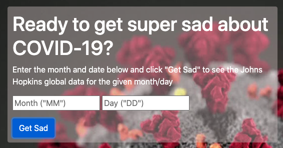

# Get Sad - the app to show you total results

### Created on 9/14/2020 (updated 9/21/2020)

### By longhike

## Description:

Using an API that'll call Johns Hopkins world-wide statistics for COVID-19, will take user entries for month and day (and validate them, throwing errors if unreadable), and then render a result with confirmed cases, deaths, and recovereds, as well as the date of the results. 

UPDATES TO COME:
1. add field to search by location
2. update date in results to US formatting
3. after Dec 31, to include a button to select either "2020" or "2021" for year.

## Set-up & Installation requirements:

You'll need your own API key for rapid-api

Node.js 

run `node server.js` or `npm start` in your terminal, and open your browser to the indicated localhost port.

## Known Bugs:

No known bugs.

## Support & Contact details:

e-mail long.hike.dev@gmail.com

## Technologies Used

HTML

CSS / Boostrap

Javascript / jQuery

Node.js

Express.js

dotenv

## Contribution Guidlines 
​
Direct link to site:
https://covid-stat-sad.herokuapp.com/
​
### License
​
Copyright(c) 2020 By longhike
​
This software is licensed under MIT license.
